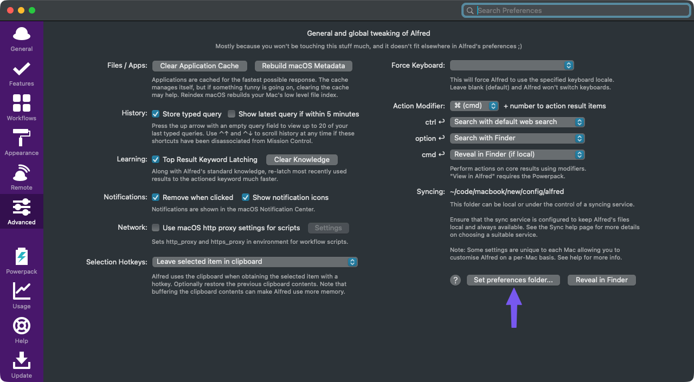

# dotfiles

"Pretty good" declarative configuration for computers using `chezmoi`.

First time install:

```shell
sh -c "$(curl -fsLS get.chezmoi.io)" -- init --apply corytheboyd
```

Once installed, update:

```shell
chezmoi_corytheboyd_update
```

## Manual Steps

### Alfred

Set Alfred preferences directory to `~/.local/share/alfred`:



## chezmoi

Override default template delimiters in shell scripts so that we can execute shellcheck against them.

```shell
# chezmoi:template:left-delimiter="#{{" right-delimiter=}}
```

<https://www.chezmoi.io/reference/templates/directives/#delimiters>

## Syncing local changes back to chezmoi

For example, VSCode settings changed in IDE, but are tracked by chezmoi.

The chezmoi command is:

```shell
chezmoi re-add $FILE
```

I have standardized it to `mise run sync` though in the `~/.config/chezmoi-corytheboyd` directory. See [private_dot_config/chezmoi-corytheboyd/mise.toml](private_dot_config/chezmoi-corytheboyd/mise.toml) for example.

### THIS IS A ONE WAY STREET

If you edit the file in chezmois source dir (`~/.local/share/chezmoi`) then this will override it with the current state of the file.

For example, if you have added `~/.config/mise/config.toml` to the list of files to be synced, and you make changes to [private_dot_conifg/mise/config.toml](private_dot_conifg/mise/config.toml), those changes will be overwritten by the contents of `~/.config/mise/config.toml`.

You should only add files to this list that are exclusively modified in normal user space, like mise, where the user runs commands like `mise use -g ruby@3` to set global tool versions.

## Homebrew

Specify packages local to the machine in `~/.config/chezmoi/chezmoi.toml`:

```toml
[data.homebrew]
    taps = []
    brews = []
    casks = []
```

Otherwise, ad-hoc installed brews will be uninstalled, so that all software is accounted for in configuration.
